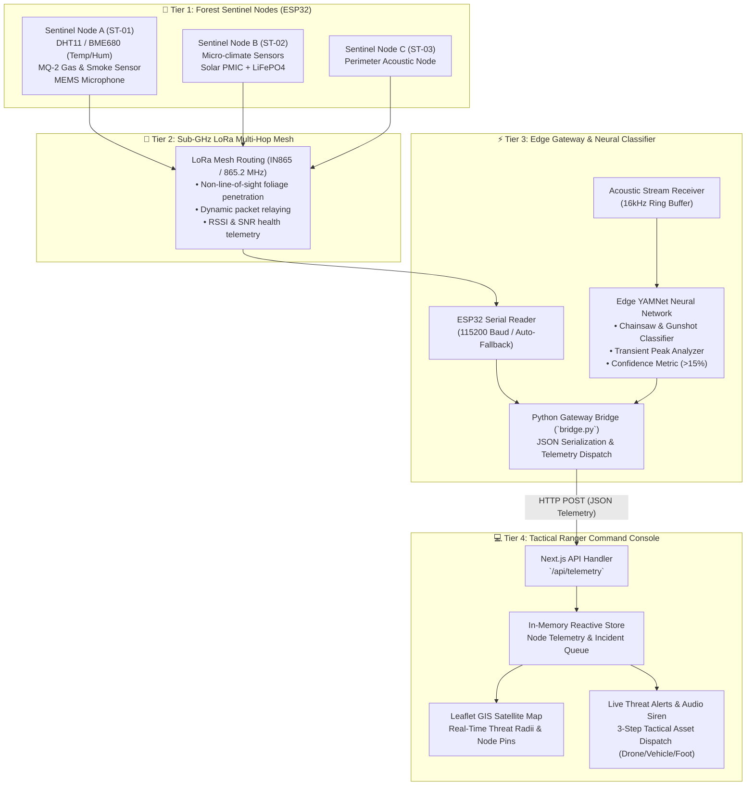

# TerraPulse: Forest Guard Mesh 🌲🛡️

[](https://www.sih.gov.in/)
[](https://nextjs.org/)
[](https://python.org/)
[](https://tfhub.dev/google/yamnet/1)
[](https://espressif.com/)
[](LICENSE)

> **Decentralized, Ultra-Low-Power Edge AI & Sub-GHz LoRa Mesh Network for Real-Time Wildfire Detection, Anti-Poaching, and Anti-Deforestation Surveillance.**

---

## 🏛️ Team Details & Organization

**Team Name:** Team NavAstra  
**Event:** Smart India Hackathon (SIH) 2026  
**Problem Statement:** Real-Time Forest Monitoring, Threat Classification, and Ranger Rapid-Response Dispatch System in Remote, Zero-Cellular Forest Enclaves.

### 👥 Team Members & Roles

| Member | Role | Key Contributions |
| :--- | :--- | :--- |
| **Mahit** | System Architecture & Network Integration | LoRa multi-hop mesh topology, node discovery protocol, and gateway fault tolerance. |
| **Dwij** | Problem Analysis & Ground Reality Research | Field forestry research, threat profiling (chainsaw/gunshot harmonics), and terrain edge cases. |
| **Utkarsh** | Embedded Systems, Edge AI & Dashboard Integration | ESP32 firmware, YAMNet acoustic classifier pipeline, serial bridge, and Next.js Ranger Console. |
| **Raunak** | Hardware Engineering & Roadmap Mitigations | Sensor enclosure weatherproofing (IP67), antenna tuning, and hardware component selection. |
| **Swayam** | Power Budgeting & Economic Disruption Analysis | Solar harvesting PMIC modeling, ultra-low power deep-sleep cycle budgets, and cost-efficiency analysis. |
| **Tanvi** | Environmental Standards & Technical Validation | Ecological safety compliance, BME680/MQ sensor baseline calibration, and QA validation. |

---

## 📖 Executive Summary

Forest reserves across India and global biodiversity hotspots lose millions of hectares annually to illegal logging, poaching, and uncontrolled forest fires. Traditional monitoring strategies face critical bottlenecks:
1. **Zero Cellular/Satellite Coverage:** Dense jungle canopies completely attenuate high-frequency wireless signals.
2. **Delayed Threat Discovery:** Satellite thermal imagery has update latencies of 4–12 hours, making real-time interception impossible.
3. **Power Inefficiencies:** Continuous sensing rapidly exhausts battery-operated remote devices.

**TerraPulse** bridges this critical gap with a four-tier defensive ecosystem:
- **Autonomous ESP32 Sentinel Nodes:** Deployed in high-risk forest zones, continuously sensing atmospheric anomalies (temperature, humidity, air quality/VOCs, gas) and streaming acoustic threat signatures.
- **Resilient Sub-GHz LoRa Mesh:** Multi-hop packet routing operating on 433/865/868 MHz ISM bands, penetrating dense foliage without reliance on cellular infrastructure.
- **Edge AI Acoustic Classification:** Real-time deep learning pipeline running Google's **YAMNet** audio neural network to isolate gunshots, chainsaws, vehicle engines, and explosions with microsecond accuracy.
- **Tactical Ranger Command Console:** Next.js 14 mission control dashboard with GIS satellite mapping, interactive acoustic spectrum visualizer, 3-step tactical asset dispatch, and instant audio sirens.

---

## 🏗️ System Architecture



---

## 🚀 Key Innovations

### 1. Multi-Modal Sensor Fusion
Combines environmental telemetry (temperature, relative humidity, VOC air resistance, smoke levels) with acoustic ML inference. Dual-trigger validation prevents false positives (e.g., distinguishing campfire smoke from active forest fires by cross-referencing temperature spikes and particulate density).

### 2. TinyML & YAMNet Acoustic Threat Classification
Utilizes Google's **YAMNet** deep neural network (trained on the 521-class AudioSet ontology) to detect critical acoustic anomalies:
- **Gunshots & Explosions:** Captures sharp transient pressure waves with sliding window temporal peak detection (`GUNSHOT_CLASSES`).
- **Chainsaws & Heavy Machinery:** Evaluates sustained harmonic frequency bands (220 Hz – 1100 Hz) matching 2-stroke mechanical cutting tools (`CHAINSAW_CLASSES`).

### 3. Sub-GHz LoRa Mesh Viability (IN865 Band)
Operates in unlicensed ISM bands (865–867 MHz in India / 433 / 868 MHz), where signal wavelengths easily diffract around dense tree trunks and wet tropical leaf canopies—achieving 5–12 km line-of-sight range and 1.5–3 km dense jungle multi-hop relaying without cellular towers.

### 4. Interactive Acoustic Spectrum Visualizer & 3-Step SOP Dispatch
The dashboard integrates a 16-band FFT spectral analyzer showing harmonic energy concentrations for chainsaws and ballistic shockwave crest factors for gunshots, paired with a 3-step rapid dispatch sequence (Foot Patrol, 4WD Interceptor, SkyEye Recon UAV).

### 5. Resilient Simulation & Auto-Discovery Fallback
`bridge.py` includes automatic hardware discovery for ESP32 COM/USB ports (`CP210x`, `CH340`, `FTDI`). In the absence of physical hardware, it seamlessly transitions into dynamic stochastic simulation mode with live microphone classification and hotkey overrides (`c` = Chainsaw, `g` = Gunshot, `f` = Fire, `n` = Normal).

---

## 🛠️ Hardware & Software Tech Stack

| Domain | Technology / Component | Purpose & Description |
| :--- | :--- | :--- |
| **Edge Compute** | **ESP32 NodeMCU (WROOM-32)** | Dual-core 240 MHz MCU managing sensor polling and serial packet formatting. |
| **RF Mesh** | **SX1276 / SX1262 LoRa Transceivers** | Long-range Sub-GHz multi-hop packet transmission with low current consumption. |
| **Environmental** | **DHT11 / BME680 & MQ-2 Series** | Precision digital temperature, humidity, atmospheric pressure, and smoke/gas detection. |
| **Acoustic Edge** | **MEMS I2S Microphone / SoundDevice** | 16 kHz 32-bit floating-point acoustic waveform sampling for sound classification. |
| **Machine Learning** | **TensorFlow & TF-Hub (YAMNet)** | 521-class AudioSet classifier for chainsaw, gunshot, engine, and explosion detection. |
| **Gateway Bridge** | **Python 3.10+ (PySerial, Requests)** | Multi-threaded serial telemetry ingestion, ML audio analysis, and REST dispatch. |
| **Frontend UI** | **Next.js 14 (App Router) + React 18** | High-performance dashboard with reactive telemetry streams and real-time state. |
| **GIS Mapping** | **Leaflet & React-Leaflet** | OpenStreetMap / Satellite hybrid cartography with custom threat radius overlays. |
| **Styling & Icons** | **TailwindCSS & Lucide Icons** | Glassmorphic dark tactical theme with cybernetic status ribbons and indicators. |

---

## 💻 Step-by-Step Local Setup & Execution Guide

### Prerequisites
- **Node.js**: v18.17+ or v20+ installed
- **Python**: v3.10+ installed
- **Microphone**: Default system microphone or USB audio input
- **Hardware (Optional)**: ESP32 connected via USB running serial output (`{"temp": 31.2, "hum": 55, "smoke": 2.1}`)

---

### Step 1: Clone Repository

```bash
git clone https://github.com/utkarsh/dashboard_SIH.git
cd dashboard_SIH
```

---

### Step 2: Next.js Command Console Setup

1. **Install NPM dependencies:**
   ```bash
   npm install
   ```

2. **Launch development server:**
   ```bash
   npm run dev
   ```

3. **Verify Dashboard:**
   Open [http://localhost:3000](http://localhost:3000) in your web browser to access the **TerraPulse Ranger Command Console**.

---

### Step 3: Python IoT Gateway Bridge Setup

1. **Create and activate a Python virtual environment:**
   ```powershell
   # Windows (PowerShell)
   python -m venv venv
   .\venv\Scripts\Activate.ps1

   # Linux / macOS (Bash)
   python3 -m venv venv
   source venv/bin/activate
   ```

2. **Install required Python packages:**
   ```bash
   pip install sounddevice requests pyserial tensorflow tensorflow-hub numpy
   ```

---

### Step 4: Run the Gateway Bridge

Launch `bridge.py` to start both the ESP32 serial reader and the live YAMNet audio classifier:

```bash
python bridge.py
```

#### Hotkey Controls & Optional CLI Arguments:
- **`c`**: Trigger Chainsaw threat simulation (3s latch)
- **`g`**: Trigger Gunshot threat simulation (3s latch)
- **`f`**: Trigger Forest Fire thermal threat simulation (3s latch)
- **`n`**: Reset back to ambient baseline

```bash
# Custom serial port, baud rate, or dashboard endpoint
python bridge.py --port COM4 --baud 115200 --url http://localhost:3000/api/telemetry --node-id ST-01
```

---

## 📊 Mission Impact Summary

- **🌿 12,400 Hectares Protected:** Continuous surveillance over Jim Corbett core and buffer zones.
- **⚡ 100% Off-Grid Solar Uptime:** LiFePO4 battery storage with intelligent deep-sleep power budgeting.
- **📡 4-Node LoRa Mesh Active:** Sub-GHz non-line-of-sight foliage penetration.
- **🛡️ Threat Interception Window < 45s:** Automated edge ML acoustic classification and ranger tactical dispatch.

---

## 📜 License

This project is developed under the **MIT License** for the Smart India Hackathon 2026.
